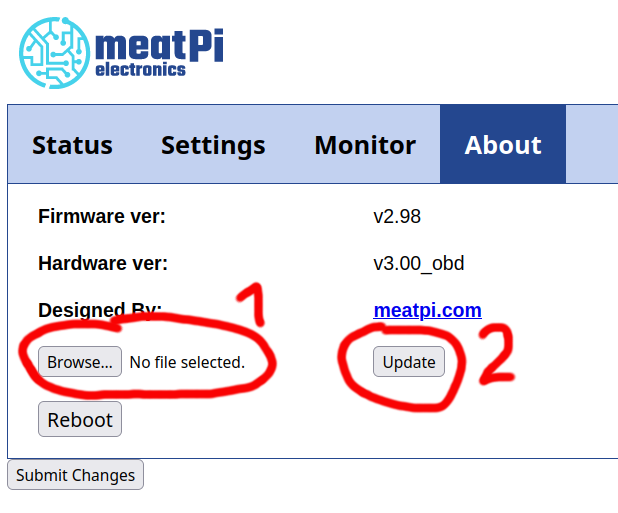
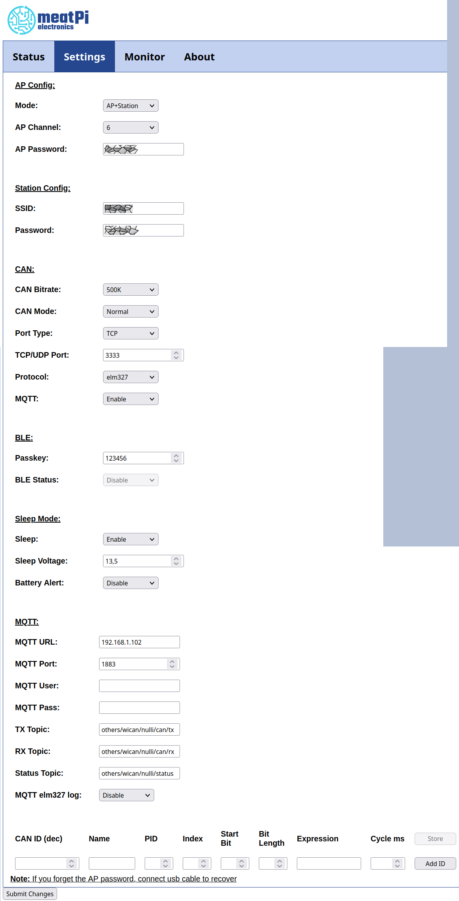

# wican, soc_helper und OpenWB: Konfiguration und Inbetriebnahme

Der soc_helper hat den Zweck, den Ladezustand und Kilometerstand eines Elektrofahrzeugs auszulesen und die OpenWB zu übertragen.
Warum?

Die OpenWB bietet die Möglichkeit, nur bis zu einem bestimmten Ladezustand zu laden. Auch kann in Abhängigkeit vom Ladezustand des Fahrzeugs auf verschiedene Weise geladen werden. So kann beispielsweise ein maximaler Ladezustand (SOC) von 80% definiert werden, um die Fahrzeugbatterie zu schonen. Oder es kann direkt nach Anstecken bis zu einem Mindestfüllstand geladen werden, darüber hinaus per PV-Überschuß und dann zu bis zu einer definierten Uhrzeit bis zu einer Grenze. Alles das setzt voraus, daß der Ladezustand der Wallbox bekannt ist.

Um den Ladezustand in die Wallbox zu bekommen, bietet diese ab Werk schon verschiedene Möglichkeiten. So kann für eine Anzahl von Fahrzeugen beim Laden periodisch die Hersteller-Cloud abgefragt werden. Eine andere Möglichkeit ist, einen MQTT-Client periodisch einen SOC-Wert in die Wallbox schreiben zu lassen. Der einfachste Weg ist, vor dem Stecken des Ladesteckers manuell (am Handy oder Wallbox-Display) den Ladezustand einzugeben - anhand derhinterlegten Batteriekapazität und des Ladewirkungsgrades sowie der durchgesetzen elektrischen Arbeit kann die OpenWB den aktuellen Ladezustand des Fahrzeugs berechnen.

Der soc_helper kommt da ins Spiel, wo kein passendes Fahrzeug-Modul vorhanden ist oder man die Hersteller-Cloud nicht nutzen oder bezahlen möchte: Der WiCAN ist ein Dongle für die Diagnosebuche von Kraftfahrzeugen. Er bietet die Möglichkeit, sich in ein WLAN einzubuchen und mit einem erreichbaren MQTT-Broker zu kommunizieren. Wenn der WiCAN eingebucht und mit einem MQTT-Broker verbunden ist, kann per MQTT eine Anforderung über den WiCAN und die Diagnosebuchse an das Fahrzeug gestellt werden. Das Fahrzeug beantwortet eine gültige Anfrage, was vom WiCAN wiederum per MQTT bekannt gegeben wird.

Der soc_helper läuft auf einem beliebigen python-fähigen Rechner im Heimnetz und stellt die Verbindung zwischen WiCAN und OpenWB her. Sobald der WiCAN sich in den MQTT-Broker der OpenWB eingebucht hat, schickt der soc_helper Abfragen von Kilometerstand und Ladezustand ab. Die Antworten des Fahrzeugs werden ausgewertet. Der Ladezustand wird in die OpenWB übertragen und dient der oben erwähnten Ladesteuerung.Durch die zusätzliche Abfrage des Kilometerstandes kann auf Wunsch mit Spritmonitor über den Verbrauch Protokoll geführt werden.

Mit der Version 2024-06-26 wurde der soc_helper erheblich überarbeitet. Die Konfiguration für Anwender ist erheblich vereinfacht, da die fahrzeugspezifischen Teile in die Datei cars.py gezogen sind, und nur noch ein Minimum an Parametern in der Konfigurationsdatei configuration.py vorhanden ist. Dafür gibt es jetzt die Möglichkeit, beliebig viele Autos mit WiCAN-Adapter mit einem System von beliebig vielen Ladepunkten an einem OpenWB-System zu betreiben.

Die OpenWB-Software 1.9 wird nicht mehr unterstützt.

# Inhalt

Die hier vorliegenden Dokumente sollen eine Schritt-für-Schritt-Anleitung zum erfolgreichen Betrieb des soc_helper geben. Für die Anleitung wird angenommen, daß ein aktuelles Raspberry-Pi-System mit raspian verwendet wird. Auf anderen Rechnern funktioniert die Prozedur ähnlich, möglicherweise unterscheiden sich aber einzelne Schritte. Die Konfiguration umfasst Folgendes:

[WiCAN konfigurieren](#wican-konfigurieren)

[Nur Einmalig: Installieren der benötigten python-Pakete](#nur-einmalig-installieren-der-benötigten-python-pakete)

[soc_helper aufspielen](#soc_helper-aufspielen)

[Optional: Vorbereitung für Spritmonitor](#optional-vorbereitung-für-spritmonitor)

[OpenWB vorbereiten](#openwb-vorbereiten)

[soc_helper konfigurieren](#soc_helper-konfigurieren)

        Anlegen der Fahrzeuge
        Anlegen der Ladepunkte
    soc_helper starten und stoppen
        Programm im Vordergrund starten und stoppen
        Programm im Hintergrund laufen lassen
        Stoppen eines nicht im Hintergrund laufenden soc_helper
        Stoppen eines im Hintergrund laufenden soc_helper
        Optional: Starten des soc_helpers mit Start des System
    Hinzufügen neuer Fahrzeugtypen
        SOC-Abfrage
        Kilometerstand-Abfrage
        SOC-Berechnung
        Kilometerstand-Berechnung
    Optional, aber hilfreich: MQTT-Explorer auf Desktop installieren
        Oberfläche
        Nutzen des MQTT-Explorers zur Fehlersuche

# WiCAN konfigurieren

## WiCAN ins eigene WLAN holen

Der WiCAN hat ein nützliches Feature: Er kann so konfiguriert werden, daß er aus dem Heimnetz erreichbar ist. So könnte theoretisch vom heimischen Rechner aus der OBD-Port des Fahrzeugs abgefragt werden. (Die App "Car Scanner" kann das auch)
Ein neuer WiCAN bucht sich natürlich noch nicht in das heimische WLAN ein. Er spannt ein offenes WLAN mit dem Namen "WiCAN_xxxxxxxxxxxx" auf (die x stehen für die 12 Ziffern der Seriennummer). Nach Einstecken des WiCAN sollte das Netzwerk in der WLAN-Suche des Smartphones oder Laptops auftauchen. Das Smartphone / der Laptop soll sich mit diesem WLAN verbinden. Beim Verbinden ist das Standard-Passwort "@meatpi#" eingeben.

Mit dem Browser kann der Dongle jetzt unter http://192.168.80.1 erreicht werden, sofern der Rechner ins WiCAN-WLAN eingebucht ist. Wichtig ist, dass kein "s" im "http" ist - Firefox setzt das automatisch!

Unter dem Reiter "Settings" muß zunächst das WLAN konfiguriert werden. Wichtige Einstellungen:

    AP Config: Mode: AP+Station
    Station Config: SSID: Name des Heimnetzes eingeben
    Station Config: Passwort: Kennwort des Heimnetzes eingeben

Unten den Knopf "Submit Changes" betätigen. Nach dem darauf folgenden Neustart sollte der WiCAN als Gerät im Heimnetzwerk auftauchen.Die IP-Adresse läßt sich im heimischen Router finden, bei der Fritz!Box unter Heimnetz->Heimnetzübersicht, Reiter Netzwerkverbindungen. Die folgenden Einstellungen erfolgen nach Aufruf der dort gelisteten IP-Adresse. Auch hier ist wieder wichtig, daß kein "s" hinter "http" vorhanden ist. Firefox setzt dieses automatisch, es muß dann per Hand entfernt werden.

Anmerkung: Meiner Erfahrung nach werden alle Einstellungen des WiCAN auf Werkseinstellung zurückgesetzt, wenn man sich über das WiCAN-eigene WLAN mit dem WiCAN verbindet. Nachdem der WiCAN im Heimnetz ist, sollte also nicht mehr in das vom WiCAN aufgespannte WLAN eingebucht werden!
## Firmware aktualisieren

Falls der WiCAN noch nicht mit Firmware 2.98 oder neuer läuft, ist ein Updateder Firmware erforderlich: Ab Version 2.98 ist es möglich, den Zweig der WiCAN-Topics im WiCAN vorzugeben. Dies ist nötig, damit das System mit der OpenWB-Software 2.1.4 oder neuer zusammen funktioniert.
### Firmware herunterladen und auspacken

Die aktuelle Firmware wird hier herunterladen: https://github.com/meatpiHQ/wican-fw/releases/

Der Name folgt dem Schema "wican-fw-vXXX_hv300.bin". Bitte das Archiv ohne den Namensbestandteil "usb" wählen!

Das Archiv auf dem Heimrechner auspacken und den Speicherort merken.

### Firmware flashen

Nach Aufruf der WiCAN-Seite im Browser (siehe "WiCAN ins eigene WLAN holen") befindet sich die Updatemöglichkeit[ ist auf dem Reiter "About":

Die Möglichkeit zum Firmwareupdate befindet sich in der WiCAN-Oberfläche unter dem Reiter "About"

Nach Klick auf "Browse..." wird im sich öffnenden Dateiauswahlmenü die wie oben beschrieben aktuelle entpackte Firmwaredatei im 
.bin-Format ausgewählt. Es handelt sich dabei um die größte der vier bin-Dateien im Archiv. Der Name folgt dem Schema "wican-fw-vXXX_hv300.bin".
Ein Klick auf "Update" lädt die Datei auf den WiCAN hoch und führt das Update durch.
Falls der WiCAN nach dem Neustart nicht mehr im Heimnetz erreichbar ist, sind die Einstellungen wieder zurückgesetzt worden. In diesem Fall den Konfigurationsschritt (WiCAN ins eigene WLAN holen) bitte erneut ausführen.

## Restliche Konfiguration

Die gesamte Konfiguration ist der Abbildung zu entnehmen:

Dazu folgende Anmerkungen:

*    MQTT muss auf Enable stehen, damit der WiCAN per MQTT erreichbar ist und Daten abgeben kann.
*    Sleep sollte auf Enable stehen, damit der WiCAN sich schlafen legt und die Niedervoltbatterie nicht belastet.
*    Sleep Voltage ist die Schwelle der Bordnetzspannung, unterhalb der der WiCAN nach etwa drei Minuten schlafen geht. Diese Schwelle sollte höher liegen als die Ruhespannung der voll geladenen Niedervoltbatterie (etwa 13,2V) aber niedriger als die Spannung beim Laden der Batterie im Zustand Fahrbereitschaft (z.B. 14,7V). Auf diese Weise wacht das Gerät auf, nachdem Fahrbereitschaft hergestellt wird und die Niedervoltbatterie geladen wird. Nach Ende der Ladung und Ablauf der Verzögerungszeit legt sich der WiCAN wieder schlafen.
*    Battery Alert sollte auf Disable stehen, hier besteht die Möglichkeit, daß der WiCAN bei Unterschreiten einer Spannungsschwelle aufwacht und per MQTT eine Alarmbotschaft verschickt. Dieses Feature wird vom soc_helper nicht genutzt.
*    MQTT URL muss die IP-Adresse beinhalten, unter der die OpenWB erreichbar ist.
*    MQTT Usernd Passwort müssen leer bleiben (bis Software 2.1.3 der OpenWB war der Inhalt beliebig).
*    TX, RX, Status Topic: Dies sind die Zweige, unter denen der WiCAN seine Informationen empfängt und veröffentlicht. Wenn er aktiv oder inaktiv wird und sich ins WLAN einbucht oder abmeldet, schreibt er eine Statusbotschaft an den unter URL definierten MQTT-Broker. Desgleichen lauscht er auf dem RX Topic auf Botschaften und sendet Informationen auf dem TX Topic. In Version 2.1.4 der OpenWB sind alle Topics bis auf einige set-Topics unbeschreibbar. Dies schützt vor versehentlichem Überschreiben der Wallbox-Konfiguration. Für Fremdnutzung ist ab der Software 2024-05-28 im Masterzweig der Zweig others/ vorgesehen. Die in der Abbildung angegebenen Zweige sind einzuhalten, der Teil "nulli" ist dabei frei wählbar - zum Beispiel der Fahrzeugname - und muß in die Konfigurationsdatei configuration.py übernommen werden. Die Gesamtlänge der Topics darf jeweils 64 Zeichen nicht überschreiten.
*    MQTT elm327 log: Sollte auf Disable stehen bleiben. Ansonsten kann man mit dem weiter unten stehenden Filter CAN-Botschaften der OBD-Schnittstelle definierten, die automatisiert umgerechnet und an den Broker geschickt werden. Im Fall soc_helper passiert dies aber nicht auf dem WiCAN.

### Prüfen der vom WiCAN gemessenen Batteriespannung

Unter dem Reiter "Status" des WiCAN ist die gemessene Bordnetzspannung zu sehen. Bei eingeschalteter Hochvolt-Batterie (Fahrbereitschaft) sollten über 13.8V und unter 15V zu sehen sein. Bei abgeschalteter Hochvolt-Batterie sollte die Spannung unter 13,5V fallen. Stehen hier doppelt so hohe Werte, wurde die falsche Firmware geflasht (die mit "usb" im Namen).  Dann bitte nochmal die richtige Firmware flashen.
Prüfen des Schlafmodus des WiCAN

Der WiCAN sollte sich einige Zeit nach Wegnahme der Fahrbereitschaft des Fahrzeugs schlafen legen, um die Niedervolt-Batterie zu schonen. Diesist der Fall, wenn die WiCAN-Seite im Heimnetz nach einigen Minuten nicht mehr erreichbar ist.
Hilfreiche Links:

zurück

#Linuxsystem konfigurieren
Vorweg: Es ist nicht nötig, Linux als Grundlage für den soc_helper zu verwenden. Theoretisch kann auch ein Desktoprechner oder Laptop mit Windows verwendet werden. Empfehlenswert ist allerdings etwas stromsparendes wie der Raspberry Pi. Weil ich mit Windows keine Erfahrungen habe, beschreibe ich hier die nötigen Tätigkeiten nach dem Aufsetzen eines Linux-Grundsystems auf einem Raspberry Pi. Für die Bedienung eines Linux-Systems von der Konsole sei auf andere Anleitungen verwiesen, da dies den Umfang dieser Anleitung bei weitem sprengen würde.

## Micro-SD-Karte bespielen:

Für die Installation von Raspbian sei auf folgende Seite verwiesen:

Anleitung und Einführung in Raspbian: ,

darunter das Beschreiben einer Micro-SD-Karte mit Raspbian: 

Es sollte ein minimales System (Raspian Lite) gewählt werden, da eine grafische Nutzeroberfläche nicht nötig ist. Die 64-Bit-Version sollte nur für die neueren Raspberries verwendet werden, den RPi4, 5 und 400. Alle anderen benötigen ein 32-Bit-System.

Bei der Installation oder beim ersten Start werden verschiedene Dinge abgefragt wie WLAN-Zugang (sofern gewünscht), Nutzername und 
Passwort, Lokalisierung. Wichtig bei der Konfiguration ist, daß **Enable ssh** angewählt wird. Damit ist später ein Betrieb ohne Monitor und Tastatur und eine Bedienung per Fernzugriff möglich.

Um später Änderungen in der Konfiguration von raspian durchzuführen, existiert das Kommando

    sudo raspi-config

das nach dem Anmelden am System eingegeben wird.

# Nur Einmalig: Installieren der benötigten python-Pakete

soc_helper benötigt ein paar Python-Bibliotheks-Pakete, um korrekt zu funktionieren. Diese müssen einmalig nachinstalliert werden. Nach dem Anmelden per ssh auf dem Pi  erfolgt dies mit dem Befehl:

sudo apt install python3-paho-mqtt python3-watchdog python3-requests

Damit ist das Grundsystem konfiguriert.

zurück

# soc_helper aufspielen

## zip-Archiv nutzen
Voraussetzung ist, daß der Raspberry Pi hochgefahren und die Erstkonfiguration erfolgt ist sowie der ssh-Zugang aktiviert ist. Die Adresse des Raspberries kann im Heimrouter gefunden werden. Wenn Tastatur und Monitor verbunden sind, kann nach Anmeldung mit dem Befehl "ifconfig" die Adresse angezeigt werden. Im Folgenden wird davon ausgegangen, daß ein Nutzer "pi" angelegt wurde und der Raspi den Namen socke die interne IP-Adresse 192.168.178.111 hat.

Mit einem geeigneten Dateiverwaltungs-Tool kann auf den Raspi zugegriffen werden. Dazu wird als Adresse sftp://pi@192.168.178.111/home/pi/ oder sftp://pi@socke angegeben. Nach Abfrage des Passwortes des Nutzers sollte der Inhalte des Homeverzeichnisses zu sehen sein. (Unter Windows kann möglicherweise winscp genutzt werden: https://winscp.net/eng/docs/lang:de. Unter Linux können beispielsweise nautilus und dolphin mit ssh umgehen.)

Das heruntergeladene zip-Archiv des soc_helper wird nun auf dem Desktop-Rechner entpackt und der Ordner soc_helper samt Inhalt per Dateiverwaltung in das Nutzerverzeichnis (/home/pi) auf den Raspi kopiert.

Fallstrick: Sollte sich bereits ein funktionierender  soc_helper auf dem Zielsystem befinden, sollte vor dem Kopiervorgang die Konfigurationsdatei configuration.py gesichert werden, zum Beispiel durch Kopieren in configuration.py.funktioniert. Es empfiehlt sich beim jetzigen Entwicklungsstand, bei jeder neuen Version die mitgelieferte Konfiguration mit Hilfe der gesicherten configuration.py an die eigenen Bedürfnisse anzupassen, da sich das Format häufiger ändern kann.

Fallstrick 2: Wenn das Archiv auf einem Windows-Rechner entpackt wurde, werden die Dateiattribute nicht gespeichert. Diese entscheiden unter Unix (und Linux), ob eine Datei lesbar / schreibar / ausführbar ist und für wen. In diesem Fall empfiehlt es sich nach dem Kopieren auf den Raspberry, die Datei soc_helper.py per Hand ausführbar zu machen, um sie direkt aufrufen zu können. Das geschieht nach dem Wechsel in das Verzeichnis soc_helper mit dem Befehl chmod 755 soc_helper.py. Siehe hierzu auch die Erklärung von ubuntu zu chmod.

## Alternativ: git nutzen
git ist ein Versionsverwaltungstool für die Softwareentwicklung. Wenn auf dem Rechner, auf dem soc_helper laufen soll git vorhanden ist, kann mit 

        git clone https://github.com/DerHerrW/soc_helper

eine Erstinstallation erfolgen. Der Befehl bewirkt, daß im Verzeichnis, in dem der Befehl ausgeführt wird, ein Verzeichnis soc_helper mit dem aktuellen Entwicklungsstand angelegt wird. Um nach einiger Zeit auf den aktuellen Stand zu kommen, muß

        git pull

ausgeführt werden. (Ich weiss gerade nicht, was mit einer lokal geänderten configuration.py passiert. Schlägt der pull fehl? Wird sie überschrieben?)

zurück

# Optional: Vorbereitung für Spritmonitor

Die Nutzung von Spritmonitor ist optional und zur Zeit der Dokumentation kostenlos. Spritmonitor ist eine große Datenbank von Verbräuchen, die von den Nutzern eingepflegt wird. Man kann dort sehen, welche Verbäuche Nutzer mit verschiedenen Fahrzeugen erzielen und wie man im Vergleich zu anderen Nutzern seines Fahrzeugs abschneidet. Es kann Buch geführt werden über Kraftstoffkosten und bei Bedarf Wartung / Reparaturen. Vorausgesetzt man gibt entsprechende Daten bei den Betankungen / Ladevorgängen ein kann sich unter anderem auswerten lassen, in welchem Monat man welchen Verbrauch erzielt.

Spritmonitor hat keine Beziehung zu soc_helper.
Spritmonitor-Zugang verschaffen und Fahrzeug anlegen

Unter https://www.spritmonitor.de kann ein Nutzerkonto angelegt werden. Unter "Mein Account" kann ein (weiteres) Fahrzeug angelegt werden. Die ID (Nummer) dieses Fahrzeuges wird später gebraucht.
Bearer-Token beschaffen und sichern

Für die Nutzung der Spritmonitor-Programmierschnittstelle durch ein Programm erfolgt keine Anmeldung per Passwort. Stattdessen wird ein App-Token und ein Bearer-Token verlangt. Das App-Token in configuration.py ist vorgegeben und sollte nicht geändert werden. Es signalisiert Spritmonitor, mit welcher App der Eintrag erfolgt. Das Bearer-Token ist nutzerindividuell und dient dazu, sich als Nutzer gegenüber Spritmonitor auszuweisen.

Um sich ein Bearer-Token zu beschaffen, meldet man sich bei Spritmonitor an und navigiert auf diese Seite: https://www.spritmonitor.de/de/mein_account/passwort_aendern.html (Von der Hauptseite: Mein Account->Passwort ändern). Dort kann man auf "Neuen Token erzeugen" klicken und bekommt ein Bearer-Token, das man sich auf seinen lokalen Rechner kopiert und gut sichert, weil es später nicht mehr angezeigt wird. Bei Verlust kann man ein neues Bearer-Token erzeugen lassen, muß dann aber eine Datei im homeverzeichnis ändern.
Bearer-Token als Umgebungsvariable bereitstellen

Das Bearer-Token wird nicht in der Konfiguratiosdatei abgespeichert. Zu groß ist die Gefahr, daß es beim Veröffentlichen oder Weitergeben in fremde Hände gerät und dann Fremde auf den eigenen Spritmonitor-Zugang zugreifen können. Statt dessen wird das BEARER_TOKEN als Umgebungsvariable des Nutzers definiert, der den soc_helper laufen läßt. Diese Definition erfolgt in der (versteckten) Datei ~/.profile (Die Tilde ist eine Abkürzung für das home-Verzeichnis, ausgeschrieben also /home/pi/.profile). Diese Datei wird bei der Anmeldung an den Rechner ausgewertet. Es ist folgende Zeile ans Ende der .profile anzufügen:

    export SPRITMONITOR_BEARER_TOKEN=<Token>

&lt;Token&gt; ist dabei die lange Zeichenkette aus dem vorigen Abschnitt. Wenn man sich nun neu auf dem pi anmeldet, auf dem der soc_helfer läuft und mit dem Befehl "export" die Umgebungsvariablen auflistet, sollte die Umgebungsvariable und ihr Inhalt zu sehen sein.

    pi@pi4:~$ export
    declare -x DBUS_SESSION_BUS_ADDRESS="unix:path=/run/user/1000/bus"
    declare -x HOME="/home/pi"
    declare -x LANG="de_DE.UTF-8"
    declare -x LOGNAME="pi"
    declare -x MOTD_SHOWN="pam"
    declare -x OLDPWD
    declare -x PATH="/usr/local/sbin:/usr/local/bin:/usr/sbin:/usr/bin:/sbin:/bin:/usr/local/games:/usr/games"
    declare -x PWD="/home/pi"
    declare -x SHELL="/bin/bash"
    declare -x SHLVL="1"
    declare -x SPRITMONITOR_BEARER_TOKEN="vdfakognevlvthrneptnhreptnrehptnrezptzhepqutzhreqp"
    declare -x SSH_CLIENT="2003:e0:171f:d200:1a36:79d:e3df:bbf 51302 22"
    declare -x SSH_CONNECTION="2003:e0:171f:d200:1a36:79d:e3df:bbf 51302 2003:e0:171f:d200:9d7:f4e0:527d:6594 22"
    declare -x SSH_TTY="/dev/pts/0"
    declare -x TERM="xterm-256color"
    declare -x TEXTDOMAIN="Linux-PAM"
    declare -x USER="pi"
    declare -x XDG_RUNTIME_DIR="/run/user/1000"
    declare -x XDG_SESSION_CLASS="user"
    declare -x XDG_SESSION_ID="18410"
    declare -x XDG_SESSION_TYPE="tty"
    pi@pi4:~$

zurück

# OpenWB vorbereiten

Um mit dem WiCAN zusammen zu arbeiten, sind ein paar Einstellungen in der OpenWB nötig. An dieser Stelle erfolgt die Beschreibung für Software-Schiene 2, für Software 1.9 ist die Konfiguration ähnlich, aber deutlich einfacher. Es wird nur der Teil beschrieben, der für den soc_helper relevant ist.

Für Software 2. Nur den für soc_helper relevanten Teil unter Konfiguration->Fahrzeuge

## Fahrzeugprofile

Im zu nutzenden Fahrzeugprofil muß die Netto-Kapazität der Fahrzeugbatterie sowie der Ladewirkungsgrad korrekt eingestellt sein, da sonst das SoC-Modul während der Ladung den Ladezustand falsch berechnet (SoC bedeutet State of Charge und ist gleichbedeutend mit Ladezustand). Der e-Up! der zweiten Generation hat eine nutzbare Batteriekapazität von 32,3kWh, dies wird hier gerundet. Beim Laden hat das Fahrzeug Verluste. Diese kommen einerseits von Nebenverbrauchern und sind unabhängig von der Ladeleistung, zum anderen hat das Ladegerät selbst von der Ladeleistungs abhängige Verluste. Die im Bild angegebenen 90% sind daher en Mittelwert. Wenn die Ladung mit geringer Leistung stattfindet, sind die Verluste höher, weil die Nebenverbraucher mehr ins Gewicht fallen. Bei hoher Leistung wird der Wirkungsgrade etwas besser sein. Hier gilt es, durch Probieren einen sinnvollen Wert herauszufinden:

Wenn der SoC nach Abstecken grundsätzlich höher ist als von der Wallbox berechnet, sollte der Wirkungsgrad heraufgesetzt werden. Wenn der Ladezustand nach Abstecken meist zu niedrig ist, sollte der Wirkungsgrad verringert werden, um der Wirklichkeit Rechnung zu tragen.

## Fahrzeuge

Unter der Fahrzeugkonfiguration ist als SoC-Modul "Manueller SoC" auszuwählen. Dieses Modul nimmt normalerweise die manuelle Eingabe des SoC und rechnet anhand HV-Speicherkapazität, Ladewirkungsgrad und gemessener Ladearbeit den SOC während der Ladung fortwährend aus. Der soc_helper nutzt die Eingabemöglichkeit und schickt den aus dem Fahrzeug asugelesenen Ladezustand an die Wallbox, die dann während der Ladung den Fahrzeug-SoC berechnet.

Der SoC wird nicht direkt aus dem Fahrzeug gelesen - das klappt nur mit der OpenWB Pro im Zusammenspiel mit einigen Fahrzeugtypen. Während der Ladung soll jede Minute der SoC aktualisiert werden, ohne Ladung ist es nicht nötig (lange ZZeitintervalle, hier 720 Minuten) und im abgesteckten Zustandergibt die Funktion keinen Sinn, daher nur aktualisieren wenn angesteckt.

## Geräte-IDs herausfinden und merken

Die IDs (Nummern) der in der Wallbox konfigurierten Geräte sind wichtig für die Konfiguration des soc_helper. Die IDs sind übersichtlich auf der Statusseite der Wallbox aufgeführt:

Für den soc_helper sind die ID der verwendeten Wallbox (im Bild "Interne openWB", ID 3) und die Nummer des Fahrzeugs, das den WiCAN verwendet ("Nulli", ID 1) wichtig. Diese Nummern sind im folgenden Kapitel wichtig.

zurück

# soc_helper konfigurieren

Alle Konfigurationsmöglichkeiten befinden sich in der Datei configuration.py. Das automatische Neueinlesen der Datei bei Änderungen wurde entfernt, da dieser Mechanismus zum Beispiel das Löschen und Neuanlegen der Datei nicht unterstützt hat und entfernte Variablen im Kontext des Hauptprogrammes nicht gelöscht wurden.
Anlegen der Fahrzeuge

Zu Beginn con configuration.py wird jeweils eine leere Liste von Fahrzeugen ("myCars") und Ladepunkten ("myChargepoints") definiert. Ein Fahrzeug wird definiert, indem ein neuer Eintrag an diese Liste angehängt wird:

    myCars.append(cars.eUp(
        name = "nulli",
        openwbVehicleId = 1,
        useSpritmonitor = True,
        spritmonitorVehicleId =  1370192,
        spritmonitorFuelsort = 24,
        spritmonitorFuelprice = 0.08,
        spritmonitorAttributes = 'summertires,slow'
    ))

Die Fahrzeugdefinitionen befinden sich in cars.p, die verfügbaren Typen sollten als Kommentar in configuration.py gelistet sein. Das Beispiel hängt der Liste ein Fahrzeug vom Typ eUp an. Diesem Fahrzeug werden mindestens der Parameter name und openwbVehicleId mit korrekten Werten übergeben.

    name ist der Name, der dem zugehörigen WiCAN bei der Konfiguration gegeben wurde (Kapitel der WiCAN-Konfiguration).
    openwbVehicleId ist die Fahrzeug-ID, die auf der OpenWB-Statusseite gelistet ist.

Fall ein Konto bei spritmonitor.de besteht, können Ladevorgänge nach Beenden automatisch dort hochgeladen werden. Erforderlich ist ein Konto und die Anlage des Fahrzeugs dort.Für die Anbindung von Spritmonitor sind folgende weitere Parameter erforderlich:

    useSpritmonitor muss True sein, damit Spritmonitor genutzt wird
    spritmonitorVehicleId ist die Fahrzeugnummer, mit der das Fahrzeug bei Spritmonitor gelistet ist
    spritmonitorFuelsort ist die Kraftstoffart, die per Default in den Betankungsvorgang eingetragen wird: 19 steht für allgemeinen Strom, 24 für Ökostrom.
    spritmonitorFuelprice ist der Default-Kraftstoffpreis pro kWh. Dies kann der Bezugspreis sein oder bei eigener PV im Sommer die entgangene Einspeisevergütung. Sinnvoll kann bei eigener PV-Anlage auch der Gestehungspreis sein (Anlagenpreis geteilt durch Stromerzeugung über Lebensdauer)
    spritmonitorAttributes ist eine Zeichenkette, in der durch Komma getrennt, Informationen über das Fahren zwischen den Tankvorgängen übergeben werden. Es sollten nur solche Attribute angegeben werden, die nahezu immer aktiv sind. Gültige Werte sind je ein Wort für Reifensorte ("summertires" / "wintertires" / "allyeartires"), die Fahrweise ("slow" / "normal" / "fast"), falls die Klimaanlage meist in Betrieb ist "ac", falls immer mit Anhänger gefahren wird "trailer", falls die Standheizung immer aktiv ist "heating". Die Zeichenkette darf leer sein ('').

Bei der Übertragung wird für den Ladevorgang automatisch angewählt, daß mit 11kW AC geladen wurde und die Lademenge durch die Wallbox gemessen wurde. Momentan ist dies hart codiert. Falls Bedarf besteht, die Ladeleistung auf beispielsweie 3,6kW zu setzen (fixes Einphasiges Laden als Defaulteinstellung), kann ich den Wert konfigurierbar gestalten. Eine Berechnung der durchschnittlichen Ladeleistung halte ich für nicht sinnvoll, da eine Ladung für den soc_helper mit Stecken des Ladesteckers beginnt und mit Abziehen endet, auch wenn schon lange vorher kein Strom mehr geflossen ist.zurück

Anlegen eines weiteren Fahrzeugs vom Typ VW MEB ohne Spritmonitor-Anbindung:
myCars.append(cars.VwMEB(
    name = "Standard",                 # Name des Fahrzeugs, wie im WiCAN konfiguriert. Definiert einen Zweig unter others/ im MQTT-Broker.
    openwbVehicleId = 0                # Fahrzeugnummer in der OpenWB-Konfiguration

))
Anlegen der Ladepunkte

Das Anlegen der Ladepunkte, die vom soc_helper genutzt werden sollen erfolgt noch einfacher: Für jeden Ladepunkt wird lediglich die Ladepunktnummer übergeben:

myChargepoints.append(chargepoints.chargepoint(chargepointId=3))
soc_helper starten und stoppen

Für diesen Schritt muß immer eine Anmeldung auf dem Raspi erfolgt sein und mit

pi@pi4:~/$ cd soc_helper

in das Verzeichnis des soc_helper gewechselt werden.
Programm im Vordergrund starten und stoppen

Für erste Tests ist es sinnvoll,den soc-Helper nicht im Hintergrund zu starten. Auf diese Weise sieht ma die Ausgaben des soc_helpers auf der Konsole.

pi@pi4:~/soc_helper$ ./soc_helper.py

Auf einen Fallstrick in Verbindung mit Windows auf dem Desktop-Rechner wird hier hingewiesen. Wenn die Dateirechte nicht richtig sind, kann trotzdem mit python ./soc_helper.py gearbeitet werden.
Programm im Hintergrund laufen lassen

Um den soc_helper mit dem Abmelden nicht zu beenden, wird der Befehl nohup ("no hangup") verwendet.

pi@pi4:~/soc_helper$ nohup ./soc_helper.py&

Das kaufmännische & am Ende bewirkt, daß der Prozess von der Konsole gelöst wird und im Hintergrund weiterarbeitet. Damit ist die Konsole frei für weitere Eingaben, zum Beispiel die Ansicht der Ausgaben mittels tail:

pi@pi4:~/soc_helper$ tail nohup.out
2024-05-02 15:14:21,799;     INFO;[      soc_helper.py:245 -        cb_status() ] WiCAN-Status: others/wican/nulli/status b'{"status": "offline"}'
2024-05-02 15:14:21,800;     INFO;[      soc_helper.py:261 -        cb_status() ] Fahrzeugstatus ist nicht <<online>>
2024-05-02 16:37:51,714;     INFO;[      soc_helper.py:245 -        cb_status() ] WiCAN-Status: others/wican/nulli/status b'{"status": "online"}'
2024-05-02 16:37:51,714;     INFO;[      soc_helper.py:251 -        cb_status() ] Fahrzeug ist online. Sende SOC- und DST-Anforderung
2024-05-02 16:37:51,715;     INFO;[      soc_helper.py:254 -        cb_status() ] Sende SOC-Anforderung: { "bus": "0", "type": "tx", "frame": [{ "id": 2021, "dlc": 8, "rtr": false, "extd": false, "data": [3, 34, 2, 140, 170, 170, 170, 170] }] }
2024-05-02 16:37:51,716;     INFO;[      soc_helper.py:258 -        cb_status() ] Sende DST-Anforderung: { "bus": "0", "type": "tx", "frame": [{ "id": 2021, "dlc": 8, "rtr": false, "extd": false, "data": [3, 34, 2, 189, 170, 170, 170, 170] }] }
2024-05-02 16:37:51,762;     INFO;[      soc_helper.py:334 -            cb_rx() ] Fahrzeug-SOC ist 75
2024-05-02 16:37:51,803;     INFO;[      soc_helper.py:344 -            cb_rx() ] Fahrzeug-Kilometerstand ist 10481
2024-05-02 16:42:09,821;     INFO;[      soc_helper.py:245 -        cb_status() ] WiCAN-Status: others/wican/nulli/status b'{"status": "offline"}'
2024-05-02 16:42:09,821;     INFO;[      soc_helper.py:261 -        cb_status() ] Fahrzeugstatus ist nicht <<online>>

In die Datei nohup.out werden alle Augaben eines Prozesses geschrieben, der mittels nohup gestartet wurde.
Stoppen eines nicht im Hintergrund laufenden soc_helper

Durch die Tastenkombination <Strg>+<C> wird der laufende Prozess abgebrochen.
Stoppen eines im Hintergrund laufenden soc_helper

Ermitteln der Prozessnummer des soc_helpers:

pi@pi4:~/soc_helper$ ps ax | grep soc
    501 ?        Ss     0:22 /usr/sbin/thd --triggers /etc/triggerhappy/triggers.d/ --socket /run/thd.socket --user nobody --deviceglob /dev/input/event*
 359528 ?        Sl     7:02 python3 ./soc_helper.py
 365331 pts/0    S+     0:00 grep soc

ps bedeutet process status und gibt die Status der laufenden Prozesse aus. die Optionen ax zeigen alle Prozesse (nicht nur die der aktuellen Sitzung) und zeigen sie mit der kompletten Aufrufzeile.  Der senkrechte Struch leitet die Ausgabe auf das Kommando grep um, das nur Zeilen durchlässt, die die Zeichenkette "soc" beinhalten.

Der Prozess mit der Nummer 359528 ist der zu beendende Prozess. (Die Nummer ist individuell und fast nie die gleiche, daher wie oben beschrieben nachsehen). Beenden des soc_helpers:

pi@pi4:~/soc_helper$ kill 359528

Die Prozessnummer ist dabei die oben ermittelte.

Eleganter geht das oben Beschriebene mit dem Befehl "pkill". Hiermit können Prozesse nach Namen beendet werden. Um alle Prozesse, die im Aufruf ein "soc_helper" tragen zu beenden, gibt man einfach

pi@pi4:~$ pkill -f soc_helper.py

ein.
Optional: Starten des soc_helpers mit Start des System

Vorweg: Falls man sehr selten Stromausfälle hat und der Rechner, auf dem der soc_helper läuft, dauerhaft an ist, kann man den soc_helper per Hand starten. Etwas komfortabler ist es, wenn mit dem Systemstart der soc_helper gleich mitgestartet wird. Hier gibt es mehrere Alternativen:
cron

cron ist Systemdienst, das bestimmte Kommandos zu definierten Zeiten ausführt. In einer Tabelle namens crontab stehen dazu die nötigen Informationen. Von dieser Tabelle gibt es neben der Version für das System für jeden Nutzer eine. In der System-crontab werden solche Sachen wie die Prüfung nach Updates, das Aufräumen temporärer Dateien oder Log-Dateien aufgerufen.

Ein Nutzer kann seine crontab mit dem Befehl crontab -e bearbeiten. In die Datei kann die Zeile

@reboot . $HOME/.profile; $HOME/soc_helper/startAtBoot.sh

eingefügt werden. Damit wird bei Neustart die mitgelieferte Datei startAtBoot.sh ausgeführt, die den soc_helper nach 10s Verzögerung startet.Bitte  darauf achten, dass das Executable-Bit von startAtBoot.sh und soc_helper.py gesetzt sind. Das ". $HOME/.profile" ist nötig, damit die in der Datei .profile definierte Variable SPRITMONITOR_BEARER_TOKEN vorhanden ist und das Hochladen bei Spritmonitor funktionieren kann.
Systemdienst für systemd

Ein Systemdienst ist prinzipiell einfach zu erstellen, erfordert aber das Anlegen einer Datei in einem Systemverzeichnis. Wer sich das zutraut, findet unter diesem Link eine hilfreiche Anleitung.

zurück

Hinzufügen neuer Fahrzeugtypen

Dein Fahrzeug ist noch nicht unterstützt? Dann bist du hier richtig. Für das zu unterstützende Fahrzeug müssen Informationen für die OBD2-Kommunikation vorliegen. Die Projekte evDash und EVNotify haben schon für einige Fahrzeuge die OBD-Kommuikation hinterlegt.

Ganz wichtig: Nach erfolgreichem Hinzufügen eines bisher nicht unterstützten Fahrzeugs schickt mir bitte die Konfiguration unter soc_helper@vortagsmett.de

Die Fahrzeuge sind in der Datei cars.py definiert. Die Datei enthält eine übergreifende Klasse carclass, die Variablen und Funktionen besitzt, die für jedes Fahrzeug gleich sind. Weiter unten folgen die Klassen der einzelnen Fahrzeugtypen. Diese erben alle Eigenschaften der carclass-Klasse und definieren darüber hinaus die Abfageparameter für SOC und Kilometerstand des jeweiligen Fahrzeugtyps. Auch die Berechnung von SoC und Kilometerstand aus den Antworten ist in diesen Klassen definiert.Die Abfrage von Werten über die CAN-Schnittstelle der OBD-Buchse erfolgt, indem eine Anfrage (Request ) an eine festgelegte Steuergeräte-ID geschickt wird. Das Steuergerät antwortet (Response) dann mit einer anderen ID und den zu der Anfrage gehörigen Datenbytes. Der WiCAN übermittelt die genannten Werte im json-Format, daher müssen diese noch in einen String vom json-Format verpackt werden.

SOC-Abfrage
self.SOC_REQ_ID = 2021
self.SOC_RESP_ID = 2029
self.SOC_REQ_DATA = [3, 34, 2, 140, 170, 170, 170, 170] self.SOC_REQUEST = '{ "bus": "0", "type": "tx", "frame": [{ "id": '+str(self.SOC_REQ_ID)+', "dlc": 8, "rtr": false, "extd": false, "data": '+str(self.SOC_REQ_DATA)+' }] }'

Es gibt Steuergeräte-IDs mit 11 Bit Länge und erweiterte IDs mit 29 Bit Länge. Wird eine lange ID verwendet, ist im json-String das false hinter "extd" durch ein True zu ersetzen!
Kilometerstand-Abfrage
 self.ODO_REQ_ID = 2021
 self.ODO_RESP_ID = 2029
 self.ODO_REQ_DATA = [3, 34, 2, 189, 170, 170, 170, 170]
 self.ODO_REQUEST = '{ "bus": "0", "type": "tx", "frame": [{ "id": '+str(self.ODO_REQ_ID)+', "dlc": 8, "rtr": false, "extd": false, "data": '+str(self.ODO_REQ_DATA)+' }] }'

Es gibt Steuergeräte-IDs mit 11 Bit Länge und erweiterte IDs mit 29 Bit Länge. Wird eine lange ID verwendet, ist im json-String das false hinter "extd" durch ein True zu ersetzen!
SOC-Berechnung

Jede Fahrzeugklasse muß eine Umrechnungsfunktion haben, die bei Aufruf eine Liste bytes von Zahlen empfängt und daraus den SoC berechnet und in der Variable self.soc abspeichert.
    def calcSOC(self, bytes):
        logging.debug(f'Daten für SoC-Berechnung: {bytes}')
        self.soc = round(bytes[4]/2.5*51/46-6.4)         # VW e-up [2029, 98, 2, 140, aa, xx, xx, xx, xx].
Kilometerstand-Berechnung

Jede Fahrzeugklasse muß eine Umrechnungsfunktion haben, die bei Aufruf eine Liste bytes von Zahlen empfängt und daraus den Kilometerstand berechnet und in der Variable self.odo abspeichert.

FIXME: continue
    def calcODO(self, bytes):
        logging.debug(f'Daten für ODO-Berechnung: {bytes}')
        self.odo =  bytes[5]*65536+bytes[6]*256+bytes[7] # VW e-up. [2029, 98, 2, 189, xx, bb, cc, dd, xx, xx]

zurück
Optional, aber hilfreich: MQTT-Explorer auf Desktop installieren

Um im Fehlerfall den Grund herauszufinden, ist der MQTT-Explorer hilfreich. Dieser zeigt alle Topics eines MQTT-Brokers an, so dass nachzuvollziehen ist, ob zum Beispiel eine Botschaft nicht gesendet wurde oder der Empfänger sie nicht wahrgenommen hat.
Oberfläche
Beschaffung:
Einrichten der Verbindung zur OpenWB

Links oben unter "Connections" das Plus-Symbol klicken. Dann die auf der rechten Seite zu sehenden Informationen und Schalterstellungen eingeben. Die Adresse der OpenWB natürlich auf die eigene Wallbox anpassen.

Anmeldefenstzer des MQTT-Explorers

Botschaften ansehen

Im linken Bereich des Fenster sind empfangen Botschaften zu sehen. Die kleinen Pfeile klappen die einzelnen Zweige der Hierarchie auf und zu. Im Bild aufgeklappt zu sehen ist die Statusbotschaft des WiCAN, mit der er sich schlafen gelegt hat.
Hauptfenster
Botschaften senden

Im vorigen Bild auf der rechten Seite zu sehen ist der Abschnitt "Publish". Unter Topic kann das MQTT-Topic eingegeben werden, unter dem Daten veröffentlicht werden sollen. In dem Kasten darunter können diese Daten eingegeben werden. Der Knopf "Publish" sendet diese Daten unter dem angegebenen Topic an den Broker der Wallbox.
Nutzen des MQTT-Explorers zur Fehlersuche

